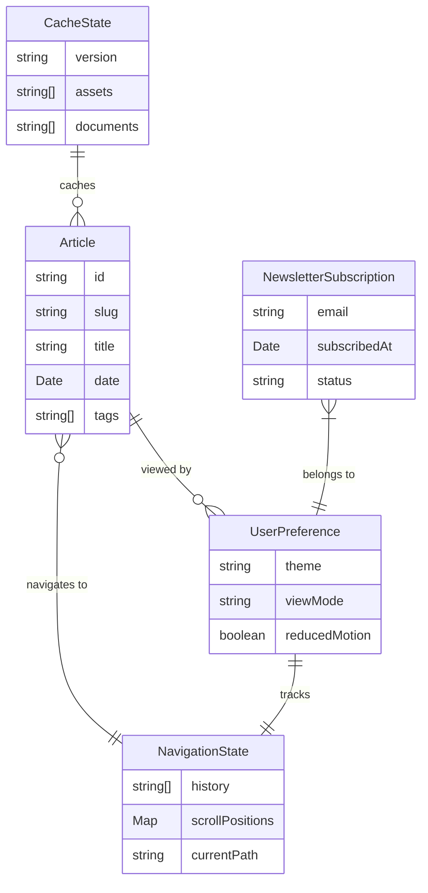

# Data Model: Migrate Personal Blog from Remix to Astro

**Date**: 2025-10-01 | **Feature**: 001-migrate-personal-blog

## Entity Definitions

### Article

Blog post content with associated metadata.

**Fields**:

- `id`: string (auto-generated from filename)
- `slug`: string (URL-friendly identifier)
- `title`: string (required)
- `date`: Date (publication date, required)
- `tags`: string[] (categorization, required)
- `description`: string (SEO meta description, required)
- `image`: string (optional hero image path)
- `draft`: boolean (exclude from production, default: false)
- `readingTime`: number (calculated in minutes)
- `body`: string (compiled MDX content)
- `Content`: Component (renderable MDX component)

**Validation Rules**:

- Title must be 1-100 characters
- Description must be 50-160 characters (SEO optimal)
- Date cannot be in the future for published posts
- Tags array must have at least one tag
- Slug must be unique across collection

**State Transitions**:

- draft → published (when draft: false)
- published → updated (when content changes)

### UserPreference

Client-side preferences for personalization.

**Fields**:

- `theme`: 'light' | 'dark' | 'system'
- `viewMode`: 'grid' | 'compact'
- `reducedMotion`: boolean
- `canvasEnabled`: boolean
- `partyMode`: boolean

**Validation Rules**:

- Theme must be valid enum value
- ViewMode must be valid enum value
- Preferences persist across sessions

**State Transitions**:

- Initialized from cookies/localStorage
- Updated via user interaction
- Persisted to storage on change

### NewsletterSubscription

Newsletter signup data.

**Fields**:

- `email`: string (required)
- `subscribedAt`: Date
- `source`: string (page where subscribed)
- `status`: 'pending' | 'confirmed' | 'unsubscribed'

**Validation Rules**:

- Email must be valid format (RFC 5322)
- Email must be unique in system
- Source must be valid page path

**State Transitions**:

- pending → confirmed (after email verification)
- confirmed → unsubscribed (user action)

### NavigationState

Browser navigation and scroll tracking.

**Fields**:

- `history`: string[] (visited paths)
- `scrollPositions`: Map<string, number>
- `currentPath`: string
- `previousPath`: string | null

**Validation Rules**:

- History limited to last 50 entries
- Paths must be valid routes
- Scroll positions non-negative

**State Transitions**:

- Updated on route change
- Scroll position saved on navigation
- Restored on back/forward

### CacheState

PWA service worker cache management.

**Fields**:

- `version`: string (cache version)
- `assets`: string[] (cached asset URLs)
- `documents`: string[] (cached HTML pages)
- `data`: string[] (cached API responses)
- `lastUpdated`: Date

**Validation Rules**:

- Version follows semver format
- URLs must be valid
- Cache size limits enforced

**State Transitions**:

- Initialized on service worker install
- Updated on new deployment
- Pruned when size exceeded

## Relationships



## Content Collection Schemas

```typescript
// src/content/config.ts
import { defineCollection, z } from 'astro:content';

const blog = defineCollection({
  type: 'content',
  schema: z.object({
    title: z.string().min(1).max(100),
    date: z.date(),
    tags: z.array(z.string()).min(1),
    description: z.string().min(50).max(160),
    image: z.string().optional(),
    draft: z.boolean().default(false),
  }),
});

export const collections = { blog };
```

## Storage Specifications

### Local Storage

```typescript
interface LocalStorageSchema {
  'user-preferences': UserPreference;
  'navigation-state': NavigationState;
  'view-mode': 'grid' | 'compact';
}
```

### Cookie Storage

```typescript
interface CookieSchema {
  theme: 'light' | 'dark' | 'system';
  'has-visited': 'true' | 'false';
}
```

### IndexedDB (PWA Cache)

```typescript
interface CacheDatabase {
  articles: Article[];
  metadata: {
    version: string;
    lastSync: Date;
  };
}
```

## Migration Mappings

### From Remix to Astro

| Remix Entity           | Astro Entity              | Changes                              |
| ---------------------- | ------------------------- | ------------------------------------ |
| `app/articles/*.mdx`   | `src/content/blog/*.mdx`  | Path change, schema validation added |
| `ArticleMetadata` type | `CollectionEntry<'blog'>` | Type-safe with Zod                   |
| `useTheme()` hook      | `UserPreference` store    | Framework-agnostic                   |
| `useFetcher()`         | Edge function + fetch     | Simplified API calls                 |
| `MetaFunction`         | Astro SEO component       | Declarative approach                 |

## Data Integrity Rules

1. **Unique Constraints**:
   - Article slugs must be globally unique
   - Newsletter emails must be unique
   - One preference object per session

2. **Referential Integrity**:
   - Tags referenced in articles must exist
   - Cached articles must match current schema
   - Navigation history must contain valid routes

3. **Cascade Rules**:
   - Deleting article removes from cache
   - Theme change updates all components
   - Clearing cache resets cache state

## Performance Considerations

- Articles are queried at build time, not runtime
- Preferences cached in memory after first read
- Navigation state limited to prevent memory leaks
- Cache pruning prevents unlimited growth
- Content collection indexes built once per build

---

_Data model complete - ready for contract generation_
