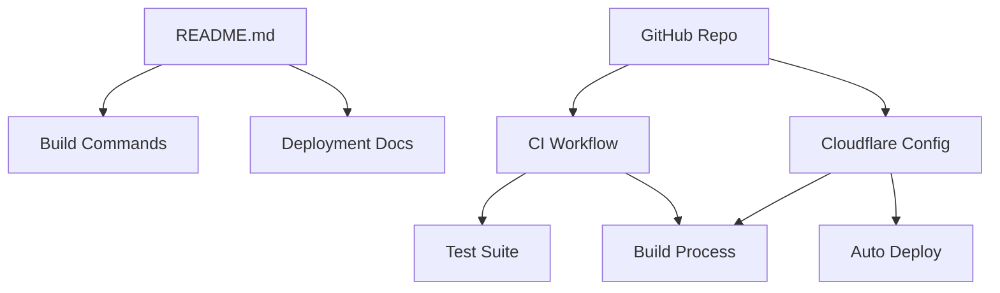

# Data Model: Update README and Prepare Cloudflare Deployment

**Date**: 2025-10-01 | **Feature**: README Update & Cloudflare Deployment

## Overview

This feature primarily involves documentation and configuration rather than
traditional data entities. The "data" consists of configuration files and
documentation content.

## Entity Definitions

### 1. README Documentation

**Type**: Markdown Document (Minimal) **Location**: `/README.md`

**Structure**:

```markdown
- Project Title
- Deployment Badge
- Brief Description
- Hero Image
- Quick Start Commands
- Link to docs directory
```

**Validation Rules**:

- Must be concise and minimal
- Quick start commands must work
- Link to docs must be valid
- Badge must show current deployment status

### 2. Documentation Files

**Type**: Markdown Documents **Location**: `/docs/`

**Files**:

```
docs/
├── README.md          # Documentation index
├── development.md     # Local development guide
├── deployment.md      # Cloudflare deployment guide
├── architecture.md    # Tech stack details
├── testing.md        # Testing guide
└── contributing.md   # Contribution guidelines
```

**Validation Rules**:

- All documentation files must exist
- Internal links must be valid
- Commands must be accurate and tested
- Examples must be working code

### 2. CI Workflow Configuration

**Type**: YAML Configuration **Location**: `.github/workflows/ci.yml`

**Structure**:

```yaml
name: string (required)
on:
  push:
    branches: array<string>
  pull_request:
    branches: array<string>
jobs:
  test:
    runs-on: string
    steps: array<Step>
```

**Step Structure**:

```yaml
- name: string (optional)
  uses: string (action reference)
  with: object (parameters)
  run: string (shell command)
```

**Validation Rules**:

- Must have at least one trigger
- Must run on ubuntu-latest
- Must use Node 20
- Must run: lint, typecheck, test, build

### 3. Cloudflare Configuration

**Type**: Platform Configuration **Location**: Cloudflare Dashboard (external)

**Properties**:

- projectName: string (required, unique)
- productionBranch: string (default: "main")
- buildCommand: string (required)
- buildOutputDirectory: string (required)
- rootDirectory: string (optional)
- nodeVersion: string (required)
- environmentVariables: Map<string, string> (optional)

**Validation Rules**:

- Project name must be unique in Cloudflare account
- Build command must produce output in specified directory
- Node version must be 20.x

## State Transitions

### README State

```
Draft -> Review -> Published
```

- **Draft**: Initial README updates being written
- **Review**: README complete, awaiting review
- **Published**: README merged to main branch

### CI Workflow State

```
Created -> Testing -> Active
```

- **Created**: Workflow file created
- **Testing**: Running test builds
- **Active**: Workflow successfully running on all commits

### Cloudflare Project State

```
Unconfigured -> Connected -> Building -> Deployed
```

- **Unconfigured**: No Cloudflare project exists
- **Connected**: GitHub repo connected to Cloudflare
- **Building**: First build in progress
- **Deployed**: Site live on Cloudflare Pages

## Relationships



## Data Flow

1. **Developer pushes code** → GitHub repository
2. **GitHub Actions triggered** → CI workflow runs tests
3. **Tests pass** → Build succeeds
4. **Push to main branch** → Cloudflare auto-deploys
5. **Deployment completes** → Badge updates

## Migration Data

### From Vercel

- Remove: `vercel.json`
- Remove: `.vercelignore`
- Remove: Vercel-specific env vars

### To Cloudflare

- Add: Cloudflare project configuration
- Add: Updated deployment documentation
- Add: New deployment badge

## Validation Requirements

### README Validation

- [ ] All commands execute successfully
- [ ] All links return 200 status
- [ ] Badge displays current status
- [ ] Structure matches template

### CI Validation

- [ ] Workflow syntax is valid
- [ ] All steps execute successfully
- [ ] Tests pass on main branch
- [ ] Build produces dist/ directory

### Cloudflare Validation

- [ ] Site deploys successfully
- [ ] Preview deployments work
- [ ] Custom domain configured (if applicable)
- [ ] Analytics enabled

---

_Data model complete - defines all configuration entities_
